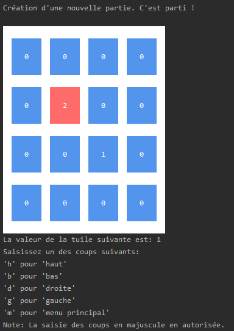
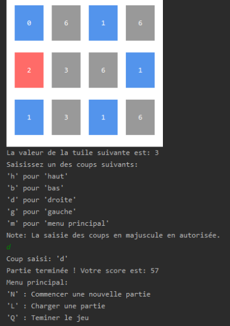
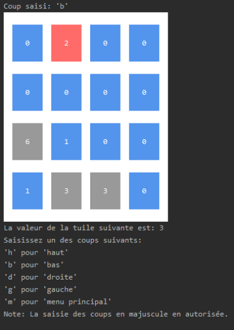
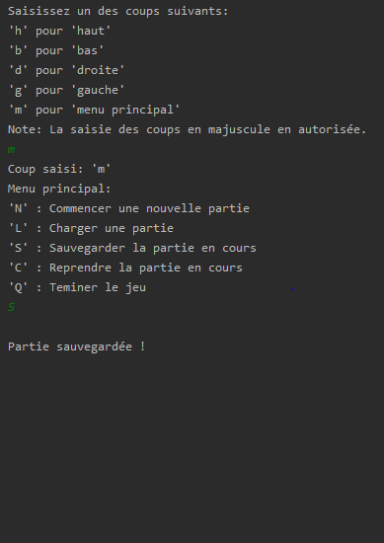

# Threes

The game "Threes" made in Python.

## Course of the project ?

This project was completed in my first academic year. It was a directed project which had for goal to make us discover the course and the management of a python project. Indeed, we had a plan that described to us the organization of python modules and the signing of the functions (not all) and we had to carry out their implementation. Some freedoms were also taken to better organize the code.

## How to use ?

To use this project, you must download the package `jeu_threes`. Then, you can start the game by starting the 'app.py' by using an IDE\* or a command like `python3 jeu_threes/app.py` in a terminal that supports UTF-8.

\* _We recommand to use an IDE or a terminal that support UTF-8 because the game use special chars to display texts using colors_.

_Note: This project use the librairy termcolor so you need to install it before using the game._

## Screens of the game

 
 
